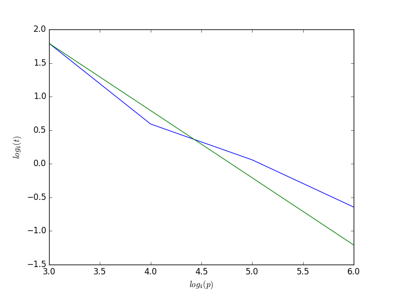

# HW4

### mpi_bugs

the comments to the solved mpi_bug_.c are reported at the beginning of the respective mpi_solved_.c 

### MPI Jacobi for 2D diffusion equation (blocking)

./jacobi-mpi2D takes as input the number of discretization point per dimension (N) and and the maximum number of iterations (it_max):

> mpirun -np 4 ./jacobi-mpi2D 1000 1000

#### Stampede timings

* Jacobi Weak Scaling (Nl = constant, it_max = 1000)

 | N	| Nl | nodes | tasks | time |
 | --- | --- | --- | --- | --- |
 | 1000  | 1000 | 1 | 1 | 19.936430 |
 | 2000 | 1000 | 1 | 4 | 20.289741 |
 | 4000 | 1000 | 1 | 16 | 20.513429 |
 | 8000 | 1000 | 4 | 64 | 21.221098 |
 | 16000 | 1000 | 16 | 256 | 21.253908 |
 | 32000 | 1000 | 64 | 1024 | 21.748358 |
 | 64000 | 1000 | 256 | 4096 | 22.681867 |

* Jacobi Weak Scaling plot (p = # of processors, t = time)

* Jacobi Strong Scaling (N = constant, it_max = 1000)

 | N	| Nl | nodes | tasks | time |
 | --- | --- | --- | --- | --- |
 | 6400 | 800 | 4 | 64 | 11.991474 |
 | 6400 | 400 | 16 | 256 | 2.270839 |
 | 6400 | 200 | 64 | 1024 | 1.084813 |
 | 6400 | 100 | 256 | 4096 | 0.409628 |

* Jacobi Strong Scaling plot (p = # of processors, t = time)

### ssort

./ssort takes as input the lenght of the initial vector (N):

> mpirun -np 4 ./ssort 1000

#### Stampede timings

| N	 | nodes | tasks | time |
| --- | --- | --- | --- |
| 100 | 4 | 64 | 0.024011 |
| 1000 | 4 | 64 | 0.030529 |
| 10000 | 4 | 64 | 0.031794 |
| 100000 | 4 | 64 | 0.055419 |

